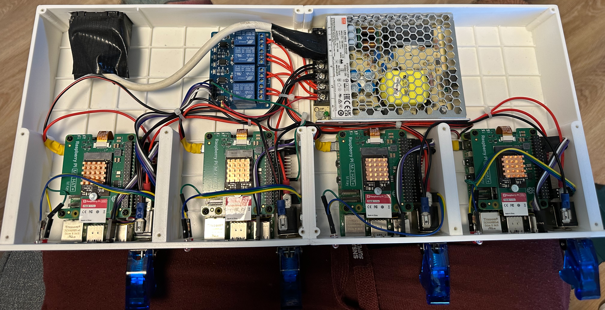

# ArgoCD
## Homelab ArgoCD Manifests
### Introduction and Disclaimer
This repository contains Kubernetes manifests for managing my HomeLab infrastructure using GitOps principles. The goal is to deploy a high-availability K3s cluster with essential applications.

**Important Notes:**
- This setup is **not** a universal solution and should **never** be used in production environments.
- renovate bot set to automatically update all the versions to the latest!
- Security measures are implemented at a level appropriate for a HomeLab but are not the primary focus.

---

### Prerequisites
**Hardware:**

- 4 × Raspberry Pi 5 devices with:
  - 8 GB RAM
  - 256 GB NVMe SSD (primary storage)
  - Fixed IP addresses
  - RaspberryPi OS Trixie (latest)
- External NAS with NFS share for backups

**Notes:**
- Hosts configured via Ansible (playbook not yet included)
- HA K3s control plane nodes that also run workloads

---

### Architecture
#### Network Configuration
- **Primary IP range:** `10.0.0.0/8`
- **Server VLAN:** `10.10.50.0/24`
- **Local domain:** `local.asztalos.net`
- **Worker Node IPs:**
  - `10.10.50.21`
- **Control Plane Node IPs:**
  - `10.10.50.22`
  - `10.10.50.23`
  - `10.10.50.24`
- **Key Services:**
  - MetalLB range: `10.10.50.30-39`
  - Traefik LB: `10.10.50.30`
  - Pi-Hole LB: `10.10.50.31`
  - Transmission LB: `10.10.50.32`
  - KubeVIP API: `10.10.50.20`
  - Homebridge MAC VLAN: `10.10.20.13`
- **NAS:** `unvr-pro.local.asztalos.net (10.10.50.2)`

#### Core Infrastructure
- **Base System:** RaspberryPi OS Trixie
- **Kubernetes:** HA K3s v1.33.1+k3s1
  - MetalLB (service load balancer in BGP mode)
  - KubeVIP (control plane LB in ARP mode)
- **GitOps:** ArgoCD
- **Storage:** HA Longhorn
- **Networking:**
  - Flannel
  - Multus
  - Traefik (reverse proxy)
  - Cert-manager with Let's Encrypt wildcard certificates (Cloudflare DNS challenge)
- **Authentication**
  - Authentik (OIDC/OAuth 2.0 and forward auth middleware for traefik)
    - Configured with blueprints
- **Database**
  - PostgreSQL HA (CloudNativePG)
  - redis HA
- **Security:**
  - Sealed Secrets (encrypted secret storage)
  - External Secrets Operator
  - 1Password-Connect (caching provider for ESO)
  - Reflector (cross-namespace secret replication)
- **Monitoring:**
  - kube-prometheus-stack
    - Prometheus, Grafana, Alertmanager
    - ServiceMonitors, PrometheusRules, and custom dashboards
  - Loki (single binary mode)
  - Alloy
    - node logs
    - journal logs
    - container logs
    - syslog receiver for Unifi
  - vcgen-exporter
  - nut-exporter
- **Notifications:**
  - Apprise
  - Mailrise

#### Deployed Applications
- Rancher (use it only for read-only access or ephemeral changes)
- Nginx (testing)
- whoami (testing)
- Pi-Hole + Unbound (DNS with TLS forwarding to Cloudflare DNS) + nebula-sync
- Transmission
- Flexget
- Homebridge (with multus macvlan interface)
- Paperless-NGX (Check the README!)
- netatmo-exporter
- tado-exporter

### Bootstrap Process
1. **Host Preparation:**
    `ansible-playbook setup_environment_rpi_cluster.yml`
2. **K3s Installation:**
Follow [TechnoTim's guide](https://technotim.live/posts/k3s-etcd-ansible/)
    * `git clone https://github.com/techno-tim/k3s-ansible`

      * resources/ansible.cfg
      * resources/my-cluster
    * `ansible-playbook -i inventory/my-cluster/inventory.yml site.yml`
    * `cp kubeconfig ~/.kube/config`
3. **Traefik & Cert-Manager Setup:**
Follow [TechnoTim's guide](https://technotim.live/posts/kube-traefik-cert-manager-le/)
4. **ArgoCD Deployment:**
    * `helm repo add argo https://argoproj.github.io/argo-helm`
    * `helm repo update`
    * `helm install argocd argo/argo-cd --namespace argocd --values bootstrap-values.yaml`
5. **Add your git repo to ArgoCD:**
Use the WebUI or the argocd CLI tool!
6. **GitOps Bootstrap:**
`kubectl apply -f bootstrap/app-of-apps.yaml`
7. **Create EndpointSlice for the unifi-router service:**
`kubectl apply -f apps/traefik/post-install/unifi-redirect.yaml`

---

### BGP routing
On the UDM-PRO:
  - Settings/Policy Engine/BGP -> Create new
  - Load resources/frr.conf (custom)

**Troubleshooting**
  - ssh into the UDM-PRO
  - vtysh
    - show running-config
    - show ip bgp summary
    - show ip bgp neighbors
    - show ip route
    - exit

---

### Sealed Secrets Management
**Creating Secrets:**
1. Create the secret manifest as usual
2. `kubeseal –controller-name sealed-secrets -o yaml < pihole-secret.yaml > sealed-pihole-secret.yaml`

**Backup/Restore Master Key:**
* Backup:
`kubectl get secret -n kube-system -l sealedsecrets.bitnami.com/sealed-secrets-key -o yaml > sealed-secrets-backup.key`
* Restore:
`kubectl apply -f sealed-secrets-backup.key`

---

### Known Issues
1. **Resource Usage:** High memory usage! Enterprise grade applications have high resource requirements (at least for an rPi based lightweight HomeLab). Frequent OOM kills with 4 nodes (4x8GB).
2. **EndpointSlices**: ArgoCD exclude handling of Endpoint and EndpointSlice manifests (for a good reason). Generally EndpointSlices are auto-generated by Kubernetes, based on the Service. However if the Service has no selector the EndpointSlice has to be created manually (outside of the GitOps workflow). This is the case for the unifi-redirect.yaml where we use traefik in the cluster to apply the wildcard certificate on an external page.
3. **Manual SQL command execution**: Required for proper Paperless install (see the README!).
---

### Nuke & Rebuild
1. Check your longhorn volumes. All should be healthy, backup available in NAS.
2. Check your Postgres backup. Should be working and recent backup available (on S3)
3. Turn off service monitors for cert-manager, external-secrets, onepassword-connect, sealed-secrets, traefik
4. Drain the nodes
`kubectl drain archer --delete-emptydir-data --ignore-daemonsets`
`kubectl drain lana --delete-emptydir-data --ignore-daemonsets`
`kubectl drain pam --delete-emptydir-data --ignore-daemonsets`
`kubectl drain cheryl --delete-emptydir-data --ignore-daemonsets`
5. `ansible-playbook -i inventory/my-cluster/hosts.ini reset.yml`
6. Check nodes
7. `ansible-playbook -i inventory/my-cluster/inventory.yml site.yml`
8. `cp kubeconfig ~/.kube/config`
9. Set API to use dual stack
`IPV6_CLUSTERIP="fdbf:c39a:a943:4300::1"`

`kubectl patch svc kubernetes -p '{
  "spec": {
    "ipFamilyPolicy": "PreferDualStack",
    "ipFamilies": ["IPv4", "IPv6"],
    "clusterIPs": ["10.43.0.1", "'$IPV6_CLUSTERIP'"]
  }
}'`

10. `kubectl apply -f resources/unused/system-upgrade/crd.yaml`
11. `kubectl create namespace longhorn-system`
12. `helm upgrade --install longhorn longhorn/longhorn -n longhorn-system -f values.yaml --set metrics.serviceMonitor.enabled=false`
13. `kubectl -n longhorn-system port-forward svc/longhorn-frontend 8080:80`
14. `kubectl create namespace argocd`
15. `kubectl apply -f app/argocd/pre-install/argocd-credentials.yaml`
16. `kubectl apply -f app/argocd/pre-install/bitnami-oci.yaml`
17. `kubectl apply -f app/argocd/pre-install/github-oci.yaml`
18. `kubectl apply -f app/argocd/pre-install/github-repo.yaml`
19. `helm install argocd argo/argo-cd --namespace argocd --values bootstrap-values.yaml`
20. `kubectl apply -f bootstrap/app-of-apps.yaml`
21. `kubectl -n kube-system get secret  --show-labels`
22. `kubectl apply -f sealed-secrets-key.yaml`
23. `kubectl -n kube-system get secret  --show-labels`
24. `kubectl -n kube-system delete secret <old key>`
25. `kubectl -n cattle-system port-forward svc/rancher 8081:443`
26. localhost:8081 rancher
27. Scale down all using longhorn (deployments, statefulsets, daemonsets, and delete postgres pods)
28. localhost:8080 restore all longhorn volumes (except postgres, ddns-exporter, and netatmo-exporter): 1. get the new PV name, 2. delete the new PV, 3. restore the old PV from backup with the name of the new PV, 4. create PVC (use the old name)
29. delete posgres volumes
30. Scale up cnpg deployments
31. `kubectl apply -f resources/postgres-cloud-restore.yaml`
32. Wait for DB Check DB
33. Scale up all
34. `kubectl apply -f postgresql-cluster.yaml`
35. `kubectl apply -f unifi-redirect.yaml`
36. restore service monitors and prometheus rules
37. generate new api key for the read-only account in ArgoCD and update the token in 1password

> **Note:** This setup evolves regularly. Check GitHub commits for latest updates.
